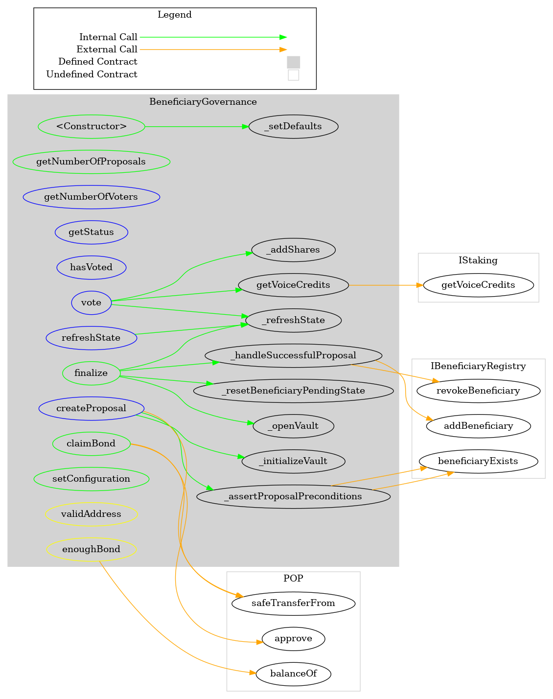
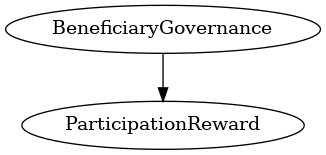

# BeneficiaryGovernance
This contract is for submitting beneficiary nomination proposals and beneficiary takedown proposals
***
## Functions:
- [`constructor()`](#constructor_)
- [`getNumberOfProposals()`](#getNumberOfProposals_)
- [`getNumberOfVoters()`](#getNumberOfVoters_)
- [`getStatus()`](#getStatus_)
- [`hasVoted()`](#hasVoted_)
- [`createProposal()`](#createProposal_)
- [`refreshState()`](#refreshState_)
- [`vote()`](#vote_)
- [`finalize()`](#finalize_)
- [`claimBond()`](#claimBond_)
- [`setConfiguration()`](#setConfiguration_)
## Events:
- [`ProposalCreated`](#ProposalCreated_)
- [`Vote`](#Vote_)
- [`Finalize`](#Finalize_)
- [`BondWithdrawn`](#BondWithdrawn_)
## Modifiers:
- [`validAddress()`](#validAddress_)
- [`enoughBond()`](#enoughBond_)
***
## Function Definitions:
### <a name="constructor_"></a> constructor() {#constructor_}
```
constructor(contract IStaking _staking, contract IBeneficiaryRegistry _beneficiaryRegistry, contract IERC20 _pop, contract IRegion _region, address _governance) public 
```
### <a name="getNumberOfProposals_"></a> getNumberOfProposals() {#getNumberOfProposals_}
```
getNumberOfProposals(enum BeneficiaryGovernance.ProposalType _type) public  returns (uint256)
```
### <a name="getNumberOfVoters_"></a> getNumberOfVoters() {#getNumberOfVoters_}
```
getNumberOfVoters(uint256 proposalId) external  returns (uint256)
```
| Parameter Name | Type | Description |
|------------|-----| -------|
| `proposalId`| uint256| id of the proposal| 
#### Return Values:
| Return Name | Type | Description |
|-------------|-------|------------|
|number| uint256|of votes to a proposal|
### <a name="getStatus_"></a> getStatus() {#getStatus_}
```
getStatus(uint256 proposalId) external  returns (enum BeneficiaryGovernance.ProposalStatus)
```
| Parameter Name | Type | Description |
|------------|-----| -------|
| `proposalId`| uint256| id of the proposal| 
#### Return Values:
| Return Name | Type | Description |
|-------------|-------|------------|
|status| uint256|of proposal|
### <a name="hasVoted_"></a> hasVoted() {#hasVoted_}
```
hasVoted(uint256 proposalId, address voter) external  returns (bool)
```
| Parameter Name | Type | Description |
|------------|-----| -------|
| `proposalId`| uint256| id of the proposal| 
| `voter`| address| address opf voter| 
### <a name="createProposal_"></a> createProposal() {#createProposal_}
```
createProposal(address _beneficiary, bytes2 _region, bytes _applicationCid, enum BeneficiaryGovernance.ProposalType _type) external  returns (uint256)
```
| Parameter Name | Type | Description |
|------------|-----| -------|
| `_beneficiary`| address| address of the beneficiary| 
| `_applicationCid`| bytes2| IPFS content hash| 
| `_type`| bytes| the proposal type (nomination / takedown)| 
### <a name="refreshState_"></a> refreshState() {#refreshState_}
```
refreshState(uint256 proposalId) external 
```
| Parameter Name | Type | Description |
|------------|-----| -------|
| `proposalId`| uint256| id of the proposal| 
### <a name="vote_"></a> vote() {#vote_}
```
vote(uint256 proposalId, enum BeneficiaryGovernance.VoteOption _vote) external 
```
| Parameter Name | Type | Description |
|------------|-----| -------|
| `proposalId`| uint256| id of the proposal which you are going to vote| 
### <a name="finalize_"></a> finalize() {#finalize_}
```
finalize(uint256 proposalId) public 
```
| Parameter Name | Type | Description |
|------------|-----| -------|
| `proposalId`| uint256| id of the proposal| 
### <a name="claimBond_"></a> claimBond() {#claimBond_}
```
claimBond(uint256 proposalId) public 
```
| Parameter Name | Type | Description |
|------------|-----| -------|
| `proposalId`| uint256| id of the proposal| 
### <a name="setConfiguration_"></a> setConfiguration() {#setConfiguration_}
```
setConfiguration(uint256 _votingPeriod, uint256 _vetoPeriod, uint256 _proposalBond) public 
```
## Events
### <a name="ProposalCreated_"></a> ProposalCreated {#ProposalCreated_}
```
ProposalCreated(uint256 proposalId, address proposer, address beneficiary, bytes applicationCid)
```
### <a name="Vote_"></a> Vote {#Vote_}
```
Vote(uint256 proposalId, address voter, uint256 weight)
```
### <a name="Finalize_"></a> Finalize {#Finalize_}
```
Finalize(uint256 proposalId)
```
### <a name="BondWithdrawn_"></a> BondWithdrawn {#BondWithdrawn_}
```
BondWithdrawn(address _address, uint256 amount)
```
## Modifiers
### <a name="validAddress_"></a> `validAddress()` {#validAddress_}
```
validAddress(address _address)
```
### <a name="enoughBond_"></a> `enoughBond()` {#enoughBond_}
```
enoughBond(address _address)
```
## Dependency Graph

## Inheritance Graph

