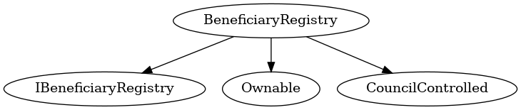

# BeneficiaryRegistry
***
## Functions:
- [`constructor()`](#constructor_)
- [`beneficiaryExists()`](#beneficiaryExists_)
- [`getBeneficiary()`](#getBeneficiary_)
- [`getBeneficiaryList()`](#getBeneficiaryList_)
- [`addBeneficiary()`](#addBeneficiary_)
- [`revokeBeneficiary()`](#revokeBeneficiary_)
## Events:
- [`BeneficiaryAdded`](#BeneficiaryAdded_)
- [`BeneficiaryRevoked`](#BeneficiaryRevoked_)
## Modifiers:
- [`validAddress()`](#validAddress_)
***
## Function Definitions:
### <a name="constructor_"></a> constructor() {#constructor_}
```
constructor(contract IRegion _region) public 
```
### <a name="beneficiaryExists_"></a> beneficiaryExists() {#beneficiaryExists_}
```
beneficiaryExists(address _address) public  returns (bool)
```
### <a name="getBeneficiary_"></a> getBeneficiary() {#getBeneficiary_}
```
getBeneficiary(address _address) public  returns (bytes)
```
### <a name="getBeneficiaryList_"></a> getBeneficiaryList() {#getBeneficiaryList_}
```
getBeneficiaryList() public  returns (address[])
```
### <a name="addBeneficiary_"></a> addBeneficiary() {#addBeneficiary_}
```
addBeneficiary(address account, bytes2 region, bytes applicationCid) external 
```
### <a name="revokeBeneficiary_"></a> revokeBeneficiary() {#revokeBeneficiary_}
```
revokeBeneficiary(address _address) external 
```
## Events
### <a name="BeneficiaryAdded_"></a> BeneficiaryAdded {#BeneficiaryAdded_}
```
BeneficiaryAdded(address _address, bytes _applicationCid)
```
### <a name="BeneficiaryRevoked_"></a> BeneficiaryRevoked {#BeneficiaryRevoked_}
```
BeneficiaryRevoked(address _address)
```
## Modifiers
### <a name="validAddress_"></a> `validAddress()` {#validAddress_}
```
validAddress(address _address)
```
## Dependency Graph

## Inheritance Graph

