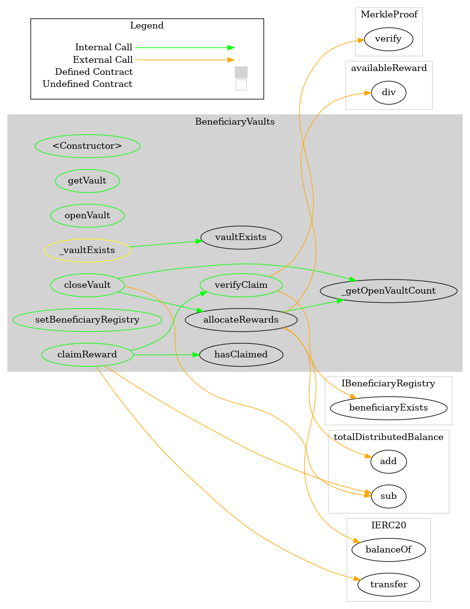
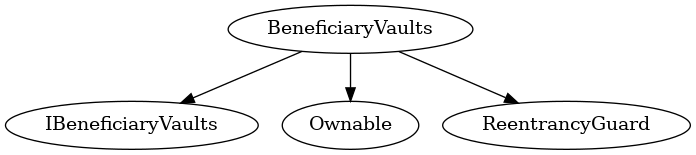

# BeneficiaryVaults
***
## Functions:
- [`constructor()`](#constructor_)
- [`getVault()`](#getVault_)
- [`hasClaimed()`](#hasClaimed_)
- [`vaultExists()`](#vaultExists_)
- [`openVault()`](#openVault_)
- [`closeVault()`](#closeVault_)
- [`verifyClaim()`](#verifyClaim_)
- [`claimReward()`](#claimReward_)
- [`allocateRewards()`](#allocateRewards_)
- [`setBeneficiaryRegistry()`](#setBeneficiaryRegistry_)
## Events:
- [`VaultOpened`](#VaultOpened_)
- [`VaultClosed`](#VaultClosed_)
- [`RewardsAllocated`](#RewardsAllocated_)
- [`RewardClaimed`](#RewardClaimed_)
- [`BeneficiaryRegistryChanged`](#BeneficiaryRegistryChanged_)
## Modifiers:
- [`_vaultExists()`](#_vaultExists_)
***
## Function Definitions:
### <a name="constructor_"></a> constructor() {#constructor_}
```
constructor(contract IERC20 pop_) public 
```
### <a name="getVault_"></a> getVault() {#getVault_}
```
getVault(uint8 vaultId_) public  returns (uint256 totalAllocated, uint256 currentBalance, uint256 unclaimedShare, bytes32 merkleRoot, enum BeneficiaryVaults.VaultStatus status)
```
### <a name="hasClaimed_"></a> hasClaimed() {#hasClaimed_}
```
hasClaimed(uint8 vaultId_, address beneficiary_) public  returns (bool)
```
### <a name="vaultExists_"></a> vaultExists() {#vaultExists_}
```
vaultExists(uint8 vaultId_) public  returns (bool)
```
### <a name="openVault_"></a> openVault() {#openVault_}
```
openVault(uint8 vaultId_, bytes32 merkleRoot_) public 
```
Vault cannot be initialized if it is currently in an open state, otherwise existing data is reset*
| Parameter Name | Type | Description |
|------------|-----| -------|
| `vaultId_`| uint8| Vault ID in range 0-2| 
| `merkleRoot_`| bytes32| Merkle root to support claims| 
### <a name="closeVault_"></a> closeVault() {#closeVault_}
```
closeVault(uint8 vaultId_) public 
```
Vault must be in an open state
| Parameter Name | Type | Description |
|------------|-----| -------|
| `vaultId_`| uint8| Vault ID in range 0-2| 
### <a name="verifyClaim_"></a> verifyClaim() {#verifyClaim_}
```
verifyClaim(uint8 vaultId_, bytes32[] proof_, address beneficiary_, uint256 share_) public  returns (bool)
```
| Parameter Name | Type | Description |
|------------|-----| -------|
| `vaultId_`| uint8| Vault ID in range 0-2| 
| `proof_`| bytes32[]| Merkle proof of path to leaf element| 
| `beneficiary_`| address| Beneficiary address encoded in leaf element| 
| `share_`| uint256| Beneficiary expected share encoded in leaf element| 
#### Return Values:
| Return Name | Type | Description |
|-------------|-------|------------|
|Returns| uint8|boolean true or false if claim is valid|
### <a name="claimReward_"></a> claimReward() {#claimReward_}
```
claimReward(uint8 vaultId_, bytes32[] proof_, address beneficiary_, uint256 share_) public 
```
Applies any outstanding rewards before processing claim
| Parameter Name | Type | Description |
|------------|-----| -------|
| `vaultId_`| uint8| Vault ID in range 0-2| 
| `proof_`| bytes32[]| Merkle proof of path to leaf element| 
| `beneficiary_`| address| Beneficiary address encoded in leaf element| 
| `share_`| uint256| Beneficiary expected share encoded in leaf element| 
### <a name="allocateRewards_"></a> allocateRewards() {#allocateRewards_}
```
allocateRewards() public 
```
Requires at least one open vault
### <a name="setBeneficiaryRegistry_"></a> setBeneficiaryRegistry() {#setBeneficiaryRegistry_}
```
setBeneficiaryRegistry(contract IBeneficiaryRegistry beneficiaryRegistry_) public 
```
Must implement IBeneficiaryRegistry and cannot be same as existing
| Parameter Name | Type | Description |
|------------|-----| -------|
| `beneficiaryRegistry_`| contract IBeneficiaryRegistry| Address of new BeneficiaryRegistry contract| 
## Events
### <a name="VaultOpened_"></a> VaultOpened {#VaultOpened_}
```
VaultOpened(uint8 vaultId, bytes32 merkleRoot)
```
### <a name="VaultClosed_"></a> VaultClosed {#VaultClosed_}
```
VaultClosed(uint8 vaultId)
```
### <a name="RewardsAllocated_"></a> RewardsAllocated {#RewardsAllocated_}
```
RewardsAllocated(uint256 amount)
```
### <a name="RewardClaimed_"></a> RewardClaimed {#RewardClaimed_}
```
RewardClaimed(uint8 vaultId, address beneficiary, uint256 amount)
```
### <a name="BeneficiaryRegistryChanged_"></a> BeneficiaryRegistryChanged {#BeneficiaryRegistryChanged_}
```
BeneficiaryRegistryChanged(contract IBeneficiaryRegistry from, contract IBeneficiaryRegistry to)
```
## Modifiers
### <a name="_vaultExists_"></a> `_vaultExists()` {#_vaultExists_}
```
_vaultExists(uint8 vaultId_)
```
## Dependency Graph

## Inheritance Graph

