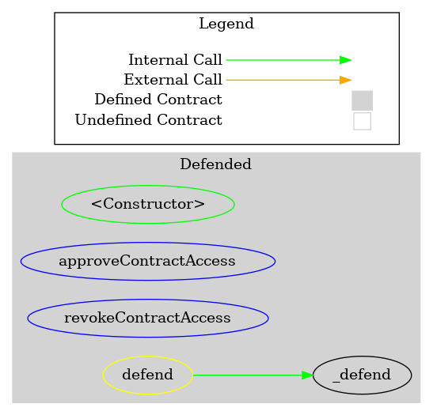
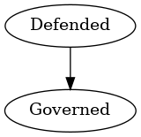

# Defended
***
## Functions:
- [`approveContractAccess()`](#approveContractAccess_)
- [`revokeContractAccess()`](#revokeContractAccess_)
## Events:
- [`AccountApproved`](#AccountApproved_)
- [`AccountRevoked`](#AccountRevoked_)
## Modifiers:
- [`defend()`](#defend_)
***
## Function Definitions:
### <a name="approveContractAccess_"></a> approveContractAccess() {#approveContractAccess_}
```
approveContractAccess(address account) external 
```
### <a name="revokeContractAccess_"></a> revokeContractAccess() {#revokeContractAccess_}
```
revokeContractAccess(address account) external 
```
## Events
### <a name="AccountApproved_"></a> AccountApproved {#AccountApproved_}
```
AccountApproved(address account)
```
### <a name="AccountRevoked_"></a> AccountRevoked {#AccountRevoked_}
```
AccountRevoked(address account)
```
## Modifiers
### <a name="defend_"></a> `defend()` {#defend_}
```
defend()
```
## Dependency Graph

## Inheritance Graph

