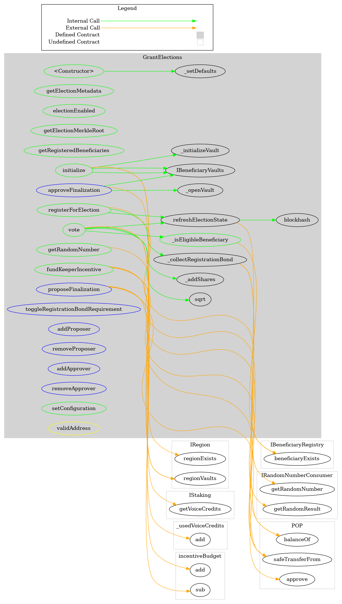
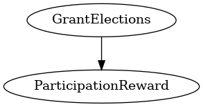

# GrantElections
***
## Functions:
- [`constructor()`](#constructor_)
- [`getElectionMetadata()`](#getElectionMetadata_)
- [`electionEnabled()`](#electionEnabled_)
- [`getElectionMerkleRoot()`](#getElectionMerkleRoot_)
- [`getRegisteredBeneficiaries()`](#getRegisteredBeneficiaries_)
- [`_isEligibleBeneficiary()`](#_isEligibleBeneficiary_)
- [`initialize()`](#initialize_)
- [`registerForElection()`](#registerForElection_)
- [`refreshElectionState()`](#refreshElectionState_)
- [`vote()`](#vote_)
- [`fundKeeperIncentive()`](#fundKeeperIncentive_)
- [`getRandomNumber()`](#getRandomNumber_)
- [`proposeFinalization()`](#proposeFinalization_)
- [`approveFinalization()`](#approveFinalization_)
- [`toggleRegistrationBondRequirement()`](#toggleRegistrationBondRequirement_)
- [`addProposer()`](#addProposer_)
- [`removeProposer()`](#removeProposer_)
- [`addApprover()`](#addApprover_)
- [`removeApprover()`](#removeApprover_)
- [`setConfiguration()`](#setConfiguration_)
## Events:
- [`BeneficiaryRegistered`](#BeneficiaryRegistered_)
- [`UserVoted`](#UserVoted_)
- [`ElectionInitialized`](#ElectionInitialized_)
- [`FinalizationProposed`](#FinalizationProposed_)
- [`ElectionFinalized`](#ElectionFinalized_)
- [`ProposerAdded`](#ProposerAdded_)
- [`ProposerRemoved`](#ProposerRemoved_)
- [`ApproverAdded`](#ApproverAdded_)
- [`ApproverRemoved`](#ApproverRemoved_)
## Modifiers:
- [`validAddress()`](#validAddress_)
***
## Function Definitions:
### <a name="constructor_"></a> constructor() {#constructor_}
```
constructor(contract IStaking _staking, contract IBeneficiaryRegistry _beneficiaryRegistry, contract IRandomNumberConsumer _randomNumberConsumer, contract IERC20 _pop, contract IRegion _region, address _governance) public 
```
### <a name="getElectionMetadata_"></a> getElectionMetadata() {#getElectionMetadata_}
```
getElectionMetadata(uint256 _electionId) public  returns (struct GrantElections.Vote[] votes_, enum GrantElections.ElectionTerm term_, address[] registeredBeneficiaries_, enum GrantElections.ElectionState state_, uint8[2] awardeesRanking_, bool useChainLinkVRF_, uint256[3] periods_, uint256 startTime_, struct GrantElections.BondRequirements bondRequirements_, enum GrantElections.ShareType shareType_, uint256 randomNumber_)
```
### <a name="electionEnabled_"></a> electionEnabled() {#electionEnabled_}
```
electionEnabled(uint256 _electionId) public  returns (bool)
```
### <a name="getElectionMerkleRoot_"></a> getElectionMerkleRoot() {#getElectionMerkleRoot_}
```
getElectionMerkleRoot(uint256 _electionId) public  returns (bytes32 merkleRoot)
```
### <a name="getRegisteredBeneficiaries_"></a> getRegisteredBeneficiaries() {#getRegisteredBeneficiaries_}
```
getRegisteredBeneficiaries(uint256 _electionId) public  returns (address[] beneficiaries)
```
### <a name="_isEligibleBeneficiary_"></a> _isEligibleBeneficiary() {#_isEligibleBeneficiary_}
```
_isEligibleBeneficiary(address _beneficiary, uint256 _electionId) public  returns (bool)
```
### <a name="initialize_"></a> initialize() {#initialize_}
```
initialize(enum GrantElections.ElectionTerm _grantTerm, bytes2 _region) public 
```
### <a name="registerForElection_"></a> registerForElection() {#registerForElection_}
```
registerForElection(address _beneficiary, uint256 _electionId) public 
```
### <a name="refreshElectionState_"></a> refreshElectionState() {#refreshElectionState_}
```
refreshElectionState(uint256 _electionId) public 
```
### <a name="vote_"></a> vote() {#vote_}
```
vote(address[] _beneficiaries, uint256[] _voiceCredits, uint256 _electionId) public 
```
### <a name="fundKeeperIncentive_"></a> fundKeeperIncentive() {#fundKeeperIncentive_}
```
fundKeeperIncentive(uint256 _amount) public 
```
### <a name="getRandomNumber_"></a> getRandomNumber() {#getRandomNumber_}
```
getRandomNumber(uint256 _electionId) public 
```
### <a name="proposeFinalization_"></a> proposeFinalization() {#proposeFinalization_}
```
proposeFinalization(uint256 _electionId, bytes32 _merkleRoot) external 
```
### <a name="approveFinalization_"></a> approveFinalization() {#approveFinalization_}
```
approveFinalization(uint256 _electionId, bytes32 _merkleRoot) external 
```
### <a name="toggleRegistrationBondRequirement_"></a> toggleRegistrationBondRequirement() {#toggleRegistrationBondRequirement_}
```
toggleRegistrationBondRequirement(enum GrantElections.ElectionTerm _term) external 
```
### <a name="addProposer_"></a> addProposer() {#addProposer_}
```
addProposer(address _proposer) external 
```
### <a name="removeProposer_"></a> removeProposer() {#removeProposer_}
```
removeProposer(address _proposer) external 
```
### <a name="addApprover_"></a> addApprover() {#addApprover_}
```
addApprover(address _approver) external 
```
### <a name="removeApprover_"></a> removeApprover() {#removeApprover_}
```
removeApprover(address _approver) external 
```
### <a name="setConfiguration_"></a> setConfiguration() {#setConfiguration_}
```
setConfiguration(enum GrantElections.ElectionTerm _term, uint8 _ranking, uint8 _awardees, bool _useChainLinkVRF, uint256 _registrationPeriod, uint256 _votingPeriod, uint256 _cooldownPeriod, uint256 _bondAmount, bool _bondRequired, uint256 _finalizationIncentive, bool _enabled, enum GrantElections.ShareType _shareType) public 
```
## Events
### <a name="BeneficiaryRegistered_"></a> BeneficiaryRegistered {#BeneficiaryRegistered_}
```
BeneficiaryRegistered(address _beneficiary, uint256 _electionId)
```
### <a name="UserVoted_"></a> UserVoted {#UserVoted_}
```
UserVoted(address _user, enum GrantElections.ElectionTerm _term)
```
### <a name="ElectionInitialized_"></a> ElectionInitialized {#ElectionInitialized_}
```
ElectionInitialized(enum GrantElections.ElectionTerm _term, bytes2 _region, uint256 _startTime)
```
### <a name="FinalizationProposed_"></a> FinalizationProposed {#FinalizationProposed_}
```
FinalizationProposed(uint256 _electionId, bytes32 _merkleRoot)
```
### <a name="ElectionFinalized_"></a> ElectionFinalized {#ElectionFinalized_}
```
ElectionFinalized(uint256 _electionId, bytes32 _merkleRoot)
```
### <a name="ProposerAdded_"></a> ProposerAdded {#ProposerAdded_}
```
ProposerAdded(address proposer)
```
### <a name="ProposerRemoved_"></a> ProposerRemoved {#ProposerRemoved_}
```
ProposerRemoved(address proposer)
```
### <a name="ApproverAdded_"></a> ApproverAdded {#ApproverAdded_}
```
ApproverAdded(address approver)
```
### <a name="ApproverRemoved_"></a> ApproverRemoved {#ApproverRemoved_}
```
ApproverRemoved(address approver)
```
## Modifiers
### <a name="validAddress_"></a> `validAddress()` {#validAddress_}
```
validAddress(address _address)
```
## Dependency Graph

## Inheritance Graph

