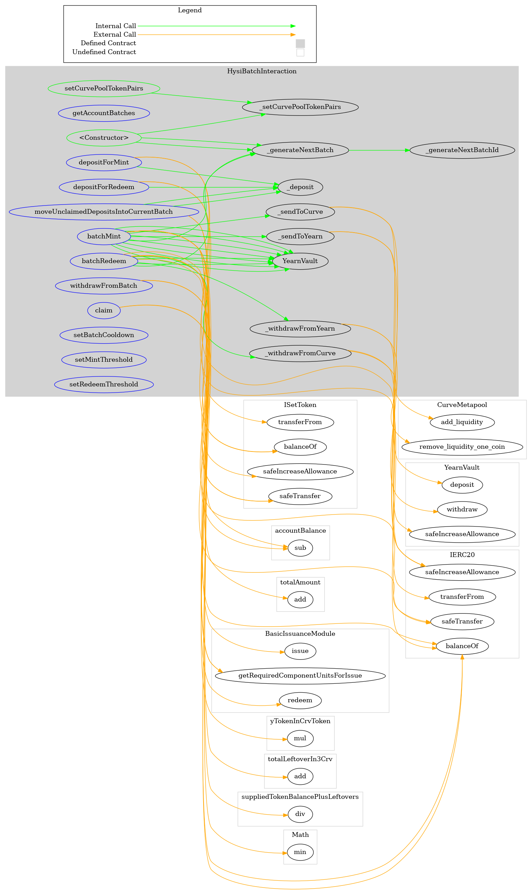
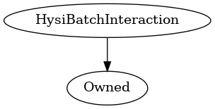

# HysiBatchInteraction
***
## Functions:
- [`constructor()`](#constructor_)
- [`getAccountBatches()`](#getAccountBatches_)
- [`depositForMint()`](#depositForMint_)
- [`depositForRedeem()`](#depositForRedeem_)
- [`withdrawFromBatch()`](#withdrawFromBatch_)
- [`claim()`](#claim_)
- [`moveUnclaimedDepositsIntoCurrentBatch()`](#moveUnclaimedDepositsIntoCurrentBatch_)
- [`batchMint()`](#batchMint_)
- [`batchRedeem()`](#batchRedeem_)
- [`setCurvePoolTokenPairs()`](#setCurvePoolTokenPairs_)
- [`setBatchCooldown()`](#setBatchCooldown_)
- [`setMintThreshold()`](#setMintThreshold_)
- [`setRedeemThreshold()`](#setRedeemThreshold_)
## Events:
- [`Deposit`](#Deposit_)
- [`Withdrawal`](#Withdrawal_)
- [`BatchMinted`](#BatchMinted_)
- [`BatchRedeemed`](#BatchRedeemed_)
- [`Claimed`](#Claimed_)
- [`TokenSetAdded`](#TokenSetAdded_)
- [`WithdrawnFromBatch`](#WithdrawnFromBatch_)
- [`MovedUnclaimedDepositsIntoCurrentBatch`](#MovedUnclaimedDepositsIntoCurrentBatch_)
***
## Function Definitions:
### <a name="constructor_"></a> constructor() {#constructor_}
```
constructor(contract IERC20 threeCrv_, contract ISetToken setToken_, contract BasicIssuanceModule basicIssuanceModule_, address[] yTokenAddresses_, struct HysiBatchInteraction.CurvePoolTokenPair[] curvePoolTokenPairs_, uint256 batchCooldown_, uint256 mintThreshold_, uint256 redeemThreshold_) public 
```
### <a name="getAccountBatches_"></a> getAccountBatches() {#getAccountBatches_}
```
getAccountBatches(address account) external  returns (bytes32[])
```
| Parameter Name | Type | Description |
|------------|-----| -------|
| `account`| address| The address for whom we want to retrieve batches| 
### <a name="depositForMint_"></a> depositForMint() {#depositForMint_}
```
depositForMint(uint256 amount_) external 
```
Should this be secured we nonReentrant?
| Parameter Name | Type | Description |
|------------|-----| -------|
| `amount_`| uint256| Amount of 3cr3CRV to use for minting| 
### <a name="depositForRedeem_"></a> depositForRedeem() {#depositForRedeem_}
```
depositForRedeem(uint256 amount_) external 
```
Should this be secured we nonReentrant?
| Parameter Name | Type | Description |
|------------|-----| -------|
| `amount_`| uint256| amount of HYSI to be redeemed| 
### <a name="withdrawFromBatch_"></a> withdrawFromBatch() {#withdrawFromBatch_}
```
withdrawFromBatch(bytes32 batchId_, uint256 amountToWithdraw_) external 
```
| Parameter Name | Type | Description |
|------------|-----| -------|
| `batchId_`| bytes32| From which batch should funds be withdrawn from| 
| `amountToWithdraw_`| uint256| Amount of HYSI or 3CRV to be withdrawn from the queue (depending on mintBatch / redeemBatch)| 
### <a name="claim_"></a> claim() {#claim_}
```
claim(bytes32 batchId_) external 
```
| Parameter Name | Type | Description |
|------------|-----| -------|
| `batchId_`| bytes32| Id of batch to claim from| 
### <a name="moveUnclaimedDepositsIntoCurrentBatch_"></a> moveUnclaimedDepositsIntoCurrentBatch() {#moveUnclaimedDepositsIntoCurrentBatch_}
```
moveUnclaimedDepositsIntoCurrentBatch(bytes32[] batchIds, uint256[] shares, enum HysiBatchInteraction.BatchType batchType) external 
```
the indices of batchIds must match the amountsInHysi to work properly (This will be done by the frontend)
| Parameter Name | Type | Description |
|------------|-----| -------|
| `batchIds`| bytes32[]| the ids of each batch where hysi should be moved from| 
| `shares`| uint256[]| how many shares should redeemed in each of the batches| 
| `batchType`| enum HysiBatchInteraction.BatchType| the batchType where funds should be taken from (Mint -> Take Hysi and redeem then, Redeem -> Take 3Crv and Mint HYSI)| 
### <a name="batchMint_"></a> batchMint() {#batchMint_}
```
batchMint(uint256 minAmountToMint_) external 
```
This function deposits 3CRV in the underlying Metapool and deposits these LP token to get yToken which in turn are used to mint HYSI
This process leaves some leftovers which are partially used in the next mint batches.
In order to get 3CRV we can implement a zap to move stables into the curve tri-pool
| Parameter Name | Type | Description |
|------------|-----| -------|
| `minAmountToMint_`| uint256| The expected min amount of hysi to mint. If hysiAmount is lower than minAmountToMint_ the transaction will revert.| 
### <a name="batchRedeem_"></a> batchRedeem() {#batchRedeem_}
```
batchRedeem(uint256 min3crvToReceive_) external 
```
This function reedeems HYSI for the underlying yToken and deposits these yToken in curve Metapools for 3CRV
In order to get stablecoins from 3CRV we can use a zap to redeem 3CRV for stables in the curve tri-pool
| Parameter Name | Type | Description |
|------------|-----| -------|
| `min3crvToReceive_`| uint256| sets minimum amount of 3crv to redeem HYSI for, otherwise the transaction will revert| 
### <a name="setCurvePoolTokenPairs_"></a> setCurvePoolTokenPairs() {#setCurvePoolTokenPairs_}
```
setCurvePoolTokenPairs(address[] yTokenAddresses_, struct HysiBatchInteraction.CurvePoolTokenPair[] curvePoolTokenPairs_) public 
```
| Parameter Name | Type | Description |
|------------|-----| -------|
| `yTokenAddresses_`| address[]| An array of addresses for the yToken needed to mint HYSI| 
| `curvePoolTokenPairs_`| struct HysiBatchInteraction.CurvePoolTokenPair[]| An array structs describing underlying yToken, crvToken and curve metapool| 
### <a name="setBatchCooldown_"></a> setBatchCooldown() {#setBatchCooldown_}
```
setBatchCooldown(uint256 cooldown_) external 
```
The cooldown is the same for redeem and mint batches
| Parameter Name | Type | Description |
|------------|-----| -------|
| `cooldown_`| uint256| Cooldown in seconds| 
### <a name="setMintThreshold_"></a> setMintThreshold() {#setMintThreshold_}
```
setMintThreshold(uint256 threshold_) external 
```
| Parameter Name | Type | Description |
|------------|-----| -------|
| `threshold_`| uint256| Amount of 3CRV necessary to mint immediately| 
### <a name="setRedeemThreshold_"></a> setRedeemThreshold() {#setRedeemThreshold_}
```
setRedeemThreshold(uint256 threshold_) external 
```
| Parameter Name | Type | Description |
|------------|-----| -------|
| `threshold_`| uint256| Amount of HYSI necessary to mint immediately| 
## Events
### <a name="Deposit_"></a> Deposit {#Deposit_}
```
Deposit(address from, uint256 deposit)
```
### <a name="Withdrawal_"></a> Withdrawal {#Withdrawal_}
```
Withdrawal(address to, uint256 amount)
```
### <a name="BatchMinted_"></a> BatchMinted {#BatchMinted_}
```
BatchMinted(bytes32 batchId, uint256 suppliedTokenAmount, uint256 hysiAmount)
```
### <a name="BatchRedeemed_"></a> BatchRedeemed {#BatchRedeemed_}
```
BatchRedeemed(bytes32 batchId, uint256 suppliedTokenAmount, uint256 threeCrvAmount)
```
### <a name="Claimed_"></a> Claimed {#Claimed_}
```
Claimed(address account, enum HysiBatchInteraction.BatchType batchType, uint256 shares, uint256 claimedToken)
```
### <a name="TokenSetAdded_"></a> TokenSetAdded {#TokenSetAdded_}
```
TokenSetAdded(contract ISetToken setToken)
```
### <a name="WithdrawnFromBatch_"></a> WithdrawnFromBatch {#WithdrawnFromBatch_}
```
WithdrawnFromBatch(bytes32 batchId, uint256 amount, address to)
```
### <a name="MovedUnclaimedDepositsIntoCurrentBatch_"></a> MovedUnclaimedDepositsIntoCurrentBatch {#MovedUnclaimedDepositsIntoCurrentBatch_}
```
MovedUnclaimedDepositsIntoCurrentBatch(uint256 amount, enum HysiBatchInteraction.BatchType batchType, address account)
```
## Dependency Graph

## Inheritance Graph

