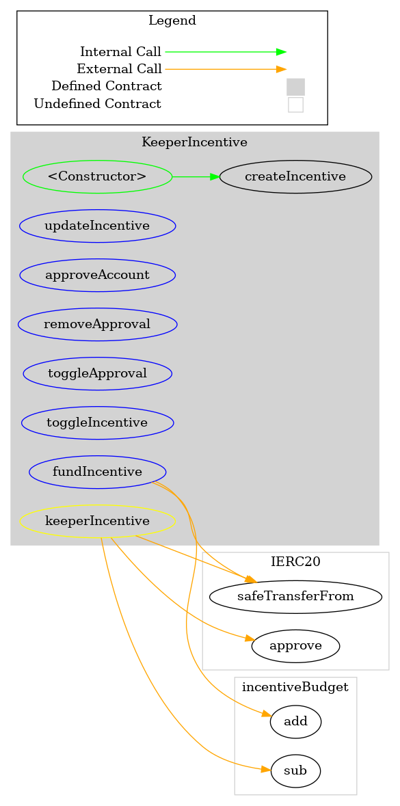
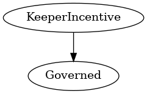

# KeeperIncentive
***
## Functions:
- [`constructor()`](#constructor_)
- [`createIncentive()`](#createIncentive_)
- [`updateIncentive()`](#updateIncentive_)
- [`approveAccount()`](#approveAccount_)
- [`removeApproval()`](#removeApproval_)
- [`toggleApproval()`](#toggleApproval_)
- [`toggleIncentive()`](#toggleIncentive_)
- [`fundIncentive()`](#fundIncentive_)
## Events:
- [`IncentiveCreated`](#IncentiveCreated_)
- [`IncentiveChanged`](#IncentiveChanged_)
- [`IncentiveFunded`](#IncentiveFunded_)
- [`Approved`](#Approved_)
- [`RemovedApproval`](#RemovedApproval_)
- [`ApprovalToggled`](#ApprovalToggled_)
- [`IncentiveToggled`](#IncentiveToggled_)
## Modifiers:
- [`keeperIncentive()`](#keeperIncentive_)
***
## Function Definitions:
### <a name="constructor_"></a> constructor() {#constructor_}
```
constructor(address _governance, contract IERC20 _pop) public 
```
### <a name="createIncentive_"></a> createIncentive() {#createIncentive_}
```
createIncentive(uint256 _reward, bool _enabled, bool _openToEveryone) public  returns (uint256)
```
This function is only for creating unique incentives for future contracts
Multiple functions can use the same incentive which can than be updated with one governance vote
Per default there will be always one incentive on index 0
| Parameter Name | Type | Description |
|------------|-----| -------|
| `_reward`| uint256| The amount in POP the Keeper receives for calling the function| 
| `_enabled`| bool| Is this Incentive currently enabled?| 
| `_openToEveryone`| bool| Can anyone call the function for rewards or only keeper?| 
### <a name="updateIncentive_"></a> updateIncentive() {#updateIncentive_}
```
updateIncentive(uint256 _incentiveId, uint256 _reward, bool _enabled, bool _openToEveryone) external 
```
### <a name="approveAccount_"></a> approveAccount() {#approveAccount_}
```
approveAccount(address _account) external 
```
### <a name="removeApproval_"></a> removeApproval() {#removeApproval_}
```
removeApproval(address _account) external 
```
### <a name="toggleApproval_"></a> toggleApproval() {#toggleApproval_}
```
toggleApproval(uint256 _incentiveId) external 
```
### <a name="toggleIncentive_"></a> toggleIncentive() {#toggleIncentive_}
```
toggleIncentive(uint256 _incentiveId) external 
```
### <a name="fundIncentive_"></a> fundIncentive() {#fundIncentive_}
```
fundIncentive(uint256 _amount) external 
```
## Events
### <a name="IncentiveCreated_"></a> IncentiveCreated {#IncentiveCreated_}
```
IncentiveCreated(uint256 incentiveId)
```
### <a name="IncentiveChanged_"></a> IncentiveChanged {#IncentiveChanged_}
```
IncentiveChanged(uint256 incentiveId)
```
### <a name="IncentiveFunded_"></a> IncentiveFunded {#IncentiveFunded_}
```
IncentiveFunded(uint256 amount)
```
### <a name="Approved_"></a> Approved {#Approved_}
```
Approved(address account)
```
### <a name="RemovedApproval_"></a> RemovedApproval {#RemovedApproval_}
```
RemovedApproval(address account)
```
### <a name="ApprovalToggled_"></a> ApprovalToggled {#ApprovalToggled_}
```
ApprovalToggled(uint256 incentiveId, bool openToEveryone)
```
### <a name="IncentiveToggled_"></a> IncentiveToggled {#IncentiveToggled_}
```
IncentiveToggled(uint256 incentiveId, bool enabled)
```
## Modifiers
### <a name="keeperIncentive_"></a> `keeperIncentive()` {#keeperIncentive_}
```
keeperIncentive(uint256 _incentiveId)
```
## Dependency Graph

## Inheritance Graph

