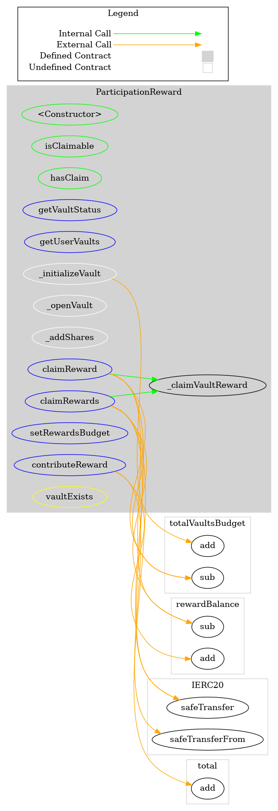

# ParticipationReward
***
## Functions:
- [`constructor()`](#constructor_)
- [`isClaimable()`](#isClaimable_)
- [`hasClaim()`](#hasClaim_)
- [`getVaultStatus()`](#getVaultStatus_)
- [`getUserVaults()`](#getUserVaults_)
- [`claimReward()`](#claimReward_)
- [`claimRewards()`](#claimRewards_)
- [`setRewardsBudget()`](#setRewardsBudget_)
- [`contributeReward()`](#contributeReward_)
## Events:
- [`RewardBudgetChanged`](#RewardBudgetChanged_)
- [`VaultInitialized`](#VaultInitialized_)
- [`VaultOpened`](#VaultOpened_)
- [`VaultClosed`](#VaultClosed_)
- [`RewardClaimed`](#RewardClaimed_)
- [`RewardsClaimed`](#RewardsClaimed_)
- [`SharesAdded`](#SharesAdded_)
- [`RewardBalanceIncreased`](#RewardBalanceIncreased_)
## Modifiers:
- [`vaultExists()`](#vaultExists_)
***
## Function Definitions:
### <a name="constructor_"></a> constructor() {#constructor_}
```
constructor(contract IERC20 _pop, address _governance) public 
```
### <a name="isClaimable_"></a> isClaimable() {#isClaimable_}
```
isClaimable(bytes32 vaultId_, address beneficiary_) public  returns (bool)
```
### <a name="hasClaim_"></a> hasClaim() {#hasClaim_}
```
hasClaim(bytes32 vaultId_, address beneficiary_) public  returns (bool)
```
| Parameter Name | Type | Description |
|------------|-----| -------|
| `vaultId_`| bytes32| Bytes32| 
| `beneficiary_`| address| address of the beneficiary| 
### <a name="getVaultStatus_"></a> getVaultStatus() {#getVaultStatus_}
```
getVaultStatus(bytes32 vaultId_) external  returns (enum ParticipationReward.VaultStatus)
```
| Parameter Name | Type | Description |
|------------|-----| -------|
| `vaultId_`| bytes32| Bytes32| 
### <a name="getUserVaults_"></a> getUserVaults() {#getUserVaults_}
```
getUserVaults(address account) external  returns (bytes32[])
```
| Parameter Name | Type | Description |
|------------|-----| -------|
| `account`| address| address| 
### <a name="claimReward_"></a> claimReward() {#claimReward_}
```
claimReward(uint256 index_) external 
```
Uses the vaultId_ at the specified index of userVaults.
This function is used when a user only wants to claim a specific vault or if they decide the gas cost of claimRewards are to high for now.
(lower cost but also lower reward)
| Parameter Name | Type | Description |
|------------|-----| -------|
| `index_`| uint256| uint256| 
### <a name="claimRewards_"></a> claimRewards() {#claimRewards_}
```
claimRewards(uint256[] indices_) external 
```
Uses the vaultIds at the specified indices of userVaults.
This function is used when a user only wants to claim multiple vaults at once (probably most of the time)
The array of indices is limited to 19 as we want to prevent gas overflow of looping through too many vaults
| Parameter Name | Type | Description |
|------------|-----| -------|
| `indices_`| uint256[]| uint256[]| 
### <a name="setRewardsBudget_"></a> setRewardsBudget() {#setRewardsBudget_}
```
setRewardsBudget(uint256 amount) external 
```
When opening a vault this contract must have enough POP to fund the rewardBudget of the new vault
| Parameter Name | Type | Description |
|------------|-----| -------|
| `amount`| uint256| uint256 reward amount in POP per vault| 
### <a name="contributeReward_"></a> contributeReward() {#contributeReward_}
```
contributeReward(uint256 amount) external 
```
Sufficient RewardsBalance will be checked when opening a new vault to see if enough POP exist to support the new Vault
| Parameter Name | Type | Description |
|------------|-----| -------|
| `amount`| uint256| uint256 amount in POP to be used for vault rewards| 
## Events
### <a name="RewardBudgetChanged_"></a> RewardBudgetChanged {#RewardBudgetChanged_}
```
RewardBudgetChanged(uint256 amount)
```
### <a name="VaultInitialized_"></a> VaultInitialized {#VaultInitialized_}
```
VaultInitialized(bytes32 vaultId)
```
### <a name="VaultOpened_"></a> VaultOpened {#VaultOpened_}
```
VaultOpened(bytes32 vaultId)
```
### <a name="VaultClosed_"></a> VaultClosed {#VaultClosed_}
```
VaultClosed(bytes32 vaultId)
```
### <a name="RewardClaimed_"></a> RewardClaimed {#RewardClaimed_}
```
RewardClaimed(bytes32 vaultId, address account_, uint256 amount)
```
### <a name="RewardsClaimed_"></a> RewardsClaimed {#RewardsClaimed_}
```
RewardsClaimed(address account_, uint256 amount)
```
### <a name="SharesAdded_"></a> SharesAdded {#SharesAdded_}
```
SharesAdded(bytes32 vaultId_, address account_, uint256 shares_)
```
### <a name="RewardBalanceIncreased_"></a> RewardBalanceIncreased {#RewardBalanceIncreased_}
```
RewardBalanceIncreased(address account, uint256 amount)
```
## Modifiers
### <a name="vaultExists_"></a> `vaultExists()` {#vaultExists_}
```
vaultExists(bytes32 vaultId_)
```
## Parameters:
- `vaultId_`: Bytes32
## Dependency Graph

## Inheritance Graph

