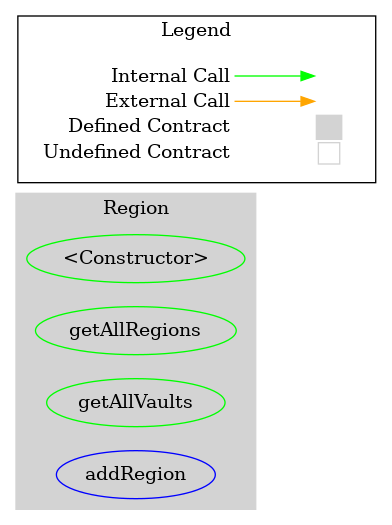
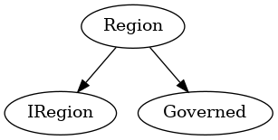

# Region
***
## Functions:
- [`constructor()`](#constructor_)
- [`getAllRegions()`](#getAllRegions_)
- [`getAllVaults()`](#getAllVaults_)
- [`addRegion()`](#addRegion_)
## Events:
- [`RegionAdded`](#RegionAdded_)
***
## Function Definitions:
### <a name="constructor_"></a> constructor() {#constructor_}
```
constructor(address beneficiaryVault_) public 
```
### <a name="getAllRegions_"></a> getAllRegions() {#getAllRegions_}
```
getAllRegions() public  returns (bytes2[])
```
### <a name="getAllVaults_"></a> getAllVaults() {#getAllVaults_}
```
getAllVaults() public  returns (address[])
```
### <a name="addRegion_"></a> addRegion() {#addRegion_}
```
addRegion(bytes2 region_, address beneficiaryVault_) external 
```
## Events
### <a name="RegionAdded_"></a> RegionAdded {#RegionAdded_}
```
RegionAdded(bytes2 region)
```
## Dependency Graph

## Inheritance Graph

