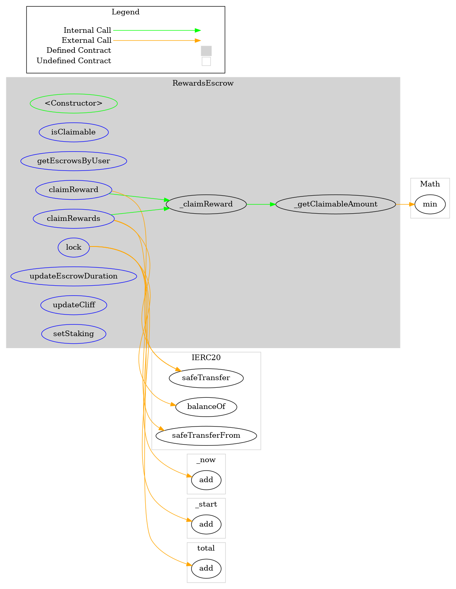
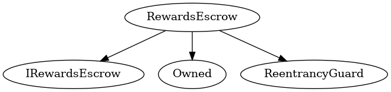

# RewardsEscrow
***
## Functions:
- [`constructor()`](#constructor_)
- [`isClaimable()`](#isClaimable_)
- [`getEscrowsByUser()`](#getEscrowsByUser_)
- [`lock()`](#lock_)
- [`claimReward()`](#claimReward_)
- [`claimRewards()`](#claimRewards_)
- [`updateEscrowDuration()`](#updateEscrowDuration_)
- [`updateCliff()`](#updateCliff_)
- [`setStaking()`](#setStaking_)
## Events:
- [`Locked`](#Locked_)
- [`RewardsClaimed`](#RewardsClaimed_)
- [`StakingChanged`](#StakingChanged_)
- [`EscrowDurationChanged`](#EscrowDurationChanged_)
- [`VestingCliffChanged`](#VestingCliffChanged_)
***
## Function Definitions:
### <a name="constructor_"></a> constructor() {#constructor_}
```
constructor(contract IERC20 _pop) public 
```
### <a name="isClaimable_"></a> isClaimable() {#isClaimable_}
```
isClaimable(bytes32 escrowId_) external  returns (bool)
```
| Parameter Name | Type | Description |
|------------|-----| -------|
| `escrowId_`| bytes32| Bytes32| 
### <a name="getEscrowsByUser_"></a> getEscrowsByUser() {#getEscrowsByUser_}
```
getEscrowsByUser(address account) external  returns (bytes32[])
```
| Parameter Name | Type | Description |
|------------|-----| -------|
| `account`| address| address| 
### <a name="lock_"></a> lock() {#lock_}
```
lock(address account_, uint256 amount_) external 
```
This creates a seperate escrow structure which can later be iterated upon to unlock the escrowed funds
### <a name="claimReward_"></a> claimReward() {#claimReward_}
```
claimReward(bytes32 escrowId_) external 
```
Uses the escrowId at the specified index of escrowIds.
This function is used when a user only wants to claim a specific escrowVault or if they decide the gas cost of claimRewards are to high for now.
(lower cost but also lower reward)
### <a name="claimRewards_"></a> claimRewards() {#claimRewards_}
```
claimRewards(bytes32[] escrowIds_) external 
```
Uses the vaultIds at the specified indices of escrowIds.
This function is used when a user only wants to claim multiple escrowVaults at once (probably most of the time)
The array of indices is limited to 20 as we want to prevent gas overflow of looping through too many vaults
TODO the upper bound of indices that can be used should be calculated with a simulation
### <a name="updateEscrowDuration_"></a> updateEscrowDuration() {#updateEscrowDuration_}
```
updateEscrowDuration(uint256 _escrowDuration) external 
```
### <a name="updateCliff_"></a> updateCliff() {#updateCliff_}
```
updateCliff(uint256 _vestingCliff) external 
```
### <a name="setStaking_"></a> setStaking() {#setStaking_}
```
setStaking(contract IStaking _staking) external 
```
## Events
### <a name="Locked_"></a> Locked {#Locked_}
```
Locked(address account, uint256 amount)
```
### <a name="RewardsClaimed_"></a> RewardsClaimed {#RewardsClaimed_}
```
RewardsClaimed(address account_, uint256 amount)
```
### <a name="StakingChanged_"></a> StakingChanged {#StakingChanged_}
```
StakingChanged(contract IStaking _staking)
```
### <a name="EscrowDurationChanged_"></a> EscrowDurationChanged {#EscrowDurationChanged_}
```
EscrowDurationChanged(uint256 _escrowDuration)
```
### <a name="VestingCliffChanged_"></a> VestingCliffChanged {#VestingCliffChanged_}
```
VestingCliffChanged(uint256 _vestingCliff)
```
## Dependency Graph

## Inheritance Graph

