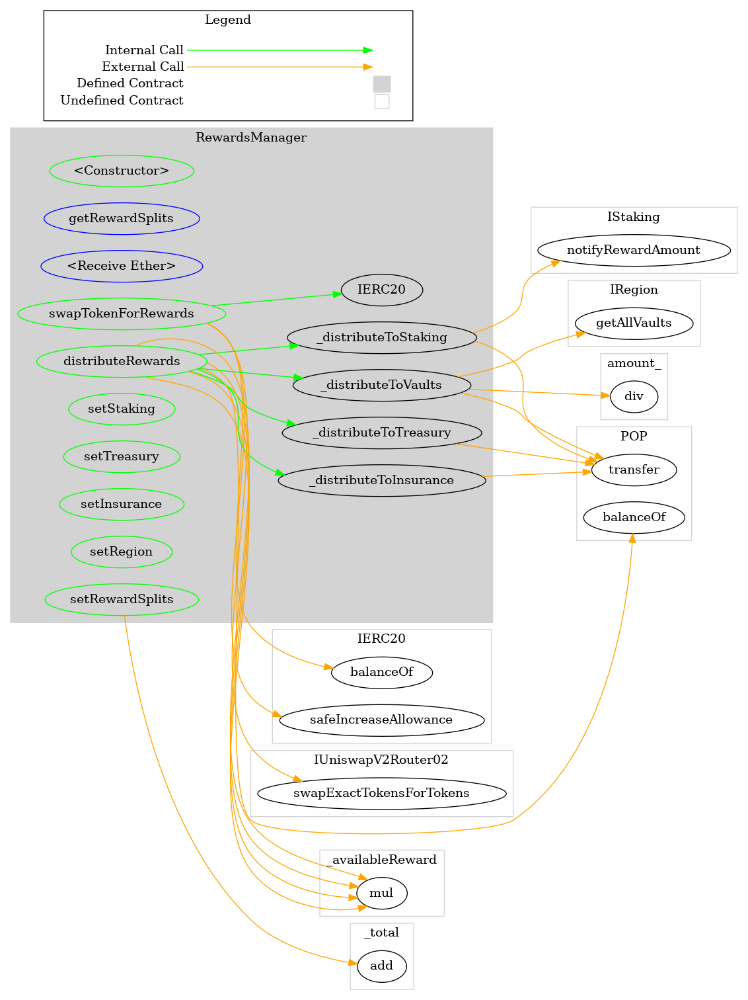
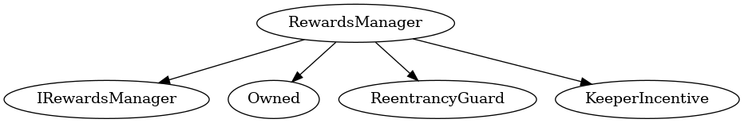

# RewardsManager
Manages distribution of POP rewards to Popcorn Treasury, DAO Staking, and Beneficiaries
***
## Functions:
- [`constructor()`](#constructor_)
- [`getRewardSplits()`](#getRewardSplits_)
- [`receive()`](#receive_)
- [`swapTokenForRewards()`](#swapTokenForRewards_)
- [`distributeRewards()`](#distributeRewards_)
- [`setStaking()`](#setStaking_)
- [`setTreasury()`](#setTreasury_)
- [`setInsurance()`](#setInsurance_)
- [`setRegion()`](#setRegion_)
- [`setRewardSplits()`](#setRewardSplits_)
## Events:
- [`StakingDeposited`](#StakingDeposited_)
- [`TreasuryDeposited`](#TreasuryDeposited_)
- [`InsuranceDeposited`](#InsuranceDeposited_)
- [`BeneficiaryVaultsDeposited`](#BeneficiaryVaultsDeposited_)
- [`RewardsDistributed`](#RewardsDistributed_)
- [`RewardSplitsUpdated`](#RewardSplitsUpdated_)
- [`TokenSwapped`](#TokenSwapped_)
- [`StakingChanged`](#StakingChanged_)
- [`TreasuryChanged`](#TreasuryChanged_)
- [`InsuranceChanged`](#InsuranceChanged_)
- [`RegionChanged`](#RegionChanged_)
***
## Function Definitions:
### <a name="constructor_"></a> constructor() {#constructor_}
```
constructor(contract IERC20 pop_, contract IStaking staking_, contract ITreasury treasury_, contract IInsurance insurance_, contract IRegion region_, contract IUniswapV2Router02 uniswapV2Router_) public 
```
### <a name="getRewardSplits_"></a> getRewardSplits() {#getRewardSplits_}
```
getRewardSplits() external  returns (uint256[4])
```
### <a name="receive_"></a> receive() {#receive_}
```
receive() external 
```
### <a name="swapTokenForRewards_"></a> swapTokenForRewards() {#swapTokenForRewards_}
```
swapTokenForRewards(address[] path_, uint256 minAmountOut_) public  returns (uint256[])
```
Path specification requires at least source token as first in path and POP address as last
Token swap internals implemented as described at https://uniswap.org/docs/v2/smart-contracts/router02/#swapexacttokensfortokens
| Parameter Name | Type | Description |
|------------|-----| -------|
| `path_`| address[]| Uniswap path specification for source token to POP| 
| `minAmountOut_`| uint256| Minimum desired amount (>0) of POP tokens to be received from swap| 
#### Return Values:
| Return Name | Type | Description |
|-------------|-------|------------|
|swapped| address[]|in/out amounts uint256 tuple|
### <a name="distributeRewards_"></a> distributeRewards() {#distributeRewards_}
```
distributeRewards() public 
```
Contract must have POP balance in order to distribute according to rewardSplits ratio
### <a name="setStaking_"></a> setStaking() {#setStaking_}
```
setStaking(contract IStaking staking_) public 
```
Must implement IStaking and cannot be same as existing
| Parameter Name | Type | Description |
|------------|-----| -------|
| `staking_`| contract IStaking| Address of new Staking contract| 
### <a name="setTreasury_"></a> setTreasury() {#setTreasury_}
```
setTreasury(contract ITreasury treasury_) public 
```
Must implement ITreasury and cannot be same as existing
| Parameter Name | Type | Description |
|------------|-----| -------|
| `treasury_`| contract ITreasury| Address of new Treasury contract| 
### <a name="setInsurance_"></a> setInsurance() {#setInsurance_}
```
setInsurance(contract IInsurance insurance_) public 
```
Must implement IInsurance and cannot be same as existing
| Parameter Name | Type | Description |
|------------|-----| -------|
| `insurance_`| contract IInsurance| Address of new Insurance contract| 
### <a name="setRegion_"></a> setRegion() {#setRegion_}
```
setRegion(contract IRegion region_) public 
```
Must implement IRegion and cannot be same as existing
| Parameter Name | Type | Description |
|------------|-----| -------|
| `region_`| contract IRegion| Address of new Region contract| 
### <a name="setRewardSplits_"></a> setRewardSplits() {#setRewardSplits_}
```
setRewardSplits(uint256[4] splits_) public 
```
Values must be within rewardsLimit range, specified in percent to 18 decimal place precision
| Parameter Name | Type | Description |
|------------|-----| -------|
| `splits_`| uint256[4]| Array of RewardTargets enumerated uint256 values within rewardLimits range| 
## Events
### <a name="StakingDeposited_"></a> StakingDeposited {#StakingDeposited_}
```
StakingDeposited(address to, uint256 amount)
```
### <a name="TreasuryDeposited_"></a> TreasuryDeposited {#TreasuryDeposited_}
```
TreasuryDeposited(address to, uint256 amount)
```
### <a name="InsuranceDeposited_"></a> InsuranceDeposited {#InsuranceDeposited_}
```
InsuranceDeposited(address to, uint256 amount)
```
### <a name="BeneficiaryVaultsDeposited_"></a> BeneficiaryVaultsDeposited {#BeneficiaryVaultsDeposited_}
```
BeneficiaryVaultsDeposited(uint256 amount)
```
### <a name="RewardsDistributed_"></a> RewardsDistributed {#RewardsDistributed_}
```
RewardsDistributed(uint256 amount)
```
### <a name="RewardSplitsUpdated_"></a> RewardSplitsUpdated {#RewardSplitsUpdated_}
```
RewardSplitsUpdated(uint256[4] splits)
```
### <a name="TokenSwapped_"></a> TokenSwapped {#TokenSwapped_}
```
TokenSwapped(address token, uint256 amountIn, uint256 amountOut)
```
### <a name="StakingChanged_"></a> StakingChanged {#StakingChanged_}
```
StakingChanged(contract IStaking from, contract IStaking to)
```
### <a name="TreasuryChanged_"></a> TreasuryChanged {#TreasuryChanged_}
```
TreasuryChanged(contract ITreasury from, contract ITreasury to)
```
### <a name="InsuranceChanged_"></a> InsuranceChanged {#InsuranceChanged_}
```
InsuranceChanged(contract IInsurance from, contract IInsurance to)
```
### <a name="RegionChanged_"></a> RegionChanged {#RegionChanged_}
```
RegionChanged(contract IRegion from, contract IRegion to)
```
## Dependency Graph

## Inheritance Graph

