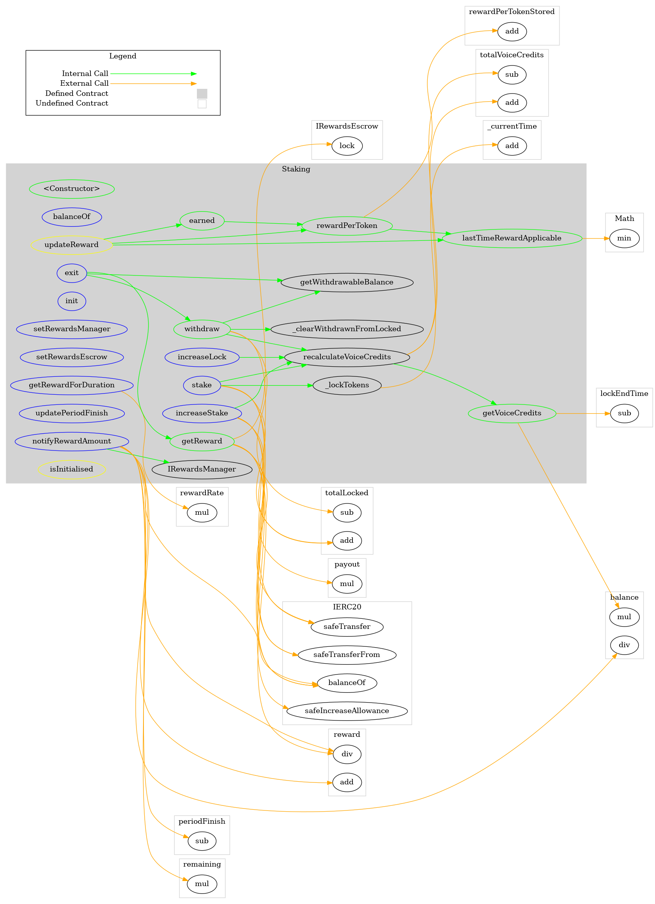
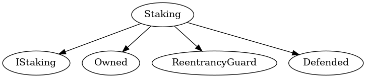

# Staking
***
## Functions:
- [`constructor()`](#constructor_)
- [`getVoiceCredits()`](#getVoiceCredits_)
- [`getWithdrawableBalance()`](#getWithdrawableBalance_)
- [`balanceOf()`](#balanceOf_)
- [`lastTimeRewardApplicable()`](#lastTimeRewardApplicable_)
- [`rewardPerToken()`](#rewardPerToken_)
- [`earned()`](#earned_)
- [`getRewardForDuration()`](#getRewardForDuration_)
- [`stake()`](#stake_)
- [`increaseLock()`](#increaseLock_)
- [`increaseStake()`](#increaseStake_)
- [`withdraw()`](#withdraw_)
- [`getReward()`](#getReward_)
- [`exit()`](#exit_)
- [`init()`](#init_)
- [`recalculateVoiceCredits()`](#recalculateVoiceCredits_)
- [`setRewardsManager()`](#setRewardsManager_)
- [`setRewardsEscrow()`](#setRewardsEscrow_)
- [`notifyRewardAmount()`](#notifyRewardAmount_)
- [`updatePeriodFinish()`](#updatePeriodFinish_)
## Events:
- [`StakingDeposited`](#StakingDeposited_)
- [`StakingWithdrawn`](#StakingWithdrawn_)
- [`RewardPaid`](#RewardPaid_)
- [`RewardAdded`](#RewardAdded_)
- [`RewardsManagerChanged`](#RewardsManagerChanged_)
- [`RewardsEscrowChanged`](#RewardsEscrowChanged_)
## Modifiers:
- [`updateReward()`](#updateReward_)
- [`isInitialised()`](#isInitialised_)
***
## Function Definitions:
### <a name="constructor_"></a> constructor() {#constructor_}
```
constructor(contract IERC20 _pop, contract IRewardsEscrow _rewardsEscrow) public 
```
### <a name="getVoiceCredits_"></a> getVoiceCredits() {#getVoiceCredits_}
```
getVoiceCredits(address _address) public  returns (uint256)
```
todo - check if multiplier is needed for calculating square root of smaller balances
| Parameter Name | Type | Description |
|------------|-----| -------|
| `_address`| address| address to get voice credits for| 
### <a name="getWithdrawableBalance_"></a> getWithdrawableBalance() {#getWithdrawableBalance_}
```
getWithdrawableBalance(address _address) public  returns (uint256)
```
### <a name="balanceOf_"></a> balanceOf() {#balanceOf_}
```
balanceOf(address _address) external  returns (uint256)
```
### <a name="lastTimeRewardApplicable_"></a> lastTimeRewardApplicable() {#lastTimeRewardApplicable_}
```
lastTimeRewardApplicable() public  returns (uint256)
```
### <a name="rewardPerToken_"></a> rewardPerToken() {#rewardPerToken_}
```
rewardPerToken() public  returns (uint256)
```
### <a name="earned_"></a> earned() {#earned_}
```
earned(address account) public  returns (uint256)
```
### <a name="getRewardForDuration_"></a> getRewardForDuration() {#getRewardForDuration_}
```
getRewardForDuration() external  returns (uint256)
```
### <a name="stake_"></a> stake() {#stake_}
```
stake(uint256 amount, uint256 lengthOfTime) external 
```
### <a name="increaseLock_"></a> increaseLock() {#increaseLock_}
```
increaseLock(uint256 lengthOfTime) external 
```
### <a name="increaseStake_"></a> increaseStake() {#increaseStake_}
```
increaseStake(uint256 amount) external 
```
### <a name="withdraw_"></a> withdraw() {#withdraw_}
```
withdraw(uint256 amount) public 
```
### <a name="getReward_"></a> getReward() {#getReward_}
```
getReward() public 
```
### <a name="exit_"></a> exit() {#exit_}
```
exit() external 
```
### <a name="init_"></a> init() {#init_}
```
init(contract IRewardsManager _rewardsManager) external 
```
### <a name="recalculateVoiceCredits_"></a> recalculateVoiceCredits() {#recalculateVoiceCredits_}
```
recalculateVoiceCredits(address _address) public 
```
### <a name="setRewardsManager_"></a> setRewardsManager() {#setRewardsManager_}
```
setRewardsManager(contract IRewardsManager _rewardsManager) external 
```
### <a name="setRewardsEscrow_"></a> setRewardsEscrow() {#setRewardsEscrow_}
```
setRewardsEscrow(contract IRewardsEscrow _rewardsEscrow) external 
```
### <a name="notifyRewardAmount_"></a> notifyRewardAmount() {#notifyRewardAmount_}
```
notifyRewardAmount(uint256 reward) external 
```
### <a name="updatePeriodFinish_"></a> updatePeriodFinish() {#updatePeriodFinish_}
```
updatePeriodFinish(uint256 timestamp) external 
```
## Events
### <a name="StakingDeposited_"></a> StakingDeposited {#StakingDeposited_}
```
StakingDeposited(address _address, uint256 amount)
```
### <a name="StakingWithdrawn_"></a> StakingWithdrawn {#StakingWithdrawn_}
```
StakingWithdrawn(address _address, uint256 amount)
```
### <a name="RewardPaid_"></a> RewardPaid {#RewardPaid_}
```
RewardPaid(address _address, uint256 reward)
```
### <a name="RewardAdded_"></a> RewardAdded {#RewardAdded_}
```
RewardAdded(uint256 reward)
```
### <a name="RewardsManagerChanged_"></a> RewardsManagerChanged {#RewardsManagerChanged_}
```
RewardsManagerChanged(contract IRewardsManager _rewardsManager)
```
### <a name="RewardsEscrowChanged_"></a> RewardsEscrowChanged {#RewardsEscrowChanged_}
```
RewardsEscrowChanged(contract IRewardsEscrow _rewardsEscrow)
```
## Modifiers
### <a name="updateReward_"></a> `updateReward()` {#updateReward_}
```
updateReward(address account)
```
### <a name="isInitialised_"></a> `isInitialised()` {#isInitialised_}
```
isInitialised()
```
## Dependency Graph

## Inheritance Graph

