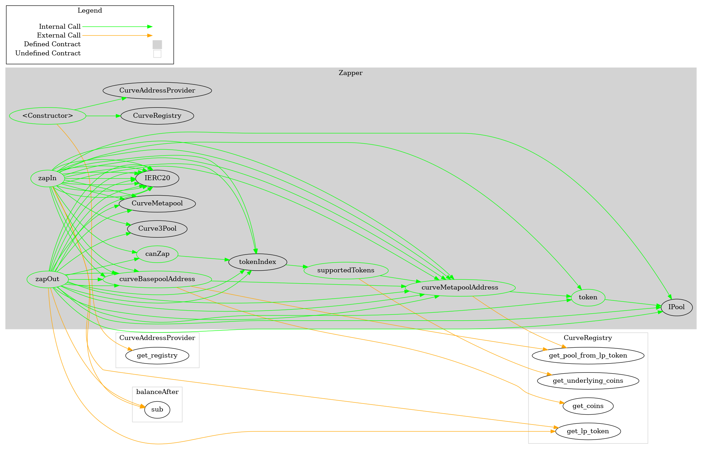
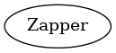

# Zapper
***
## Functions:
- [`constructor()`](#constructor_)
- [`token()`](#token_)
- [`curveMetapoolAddress()`](#curveMetapoolAddress_)
- [`curveBasepoolAddress()`](#curveBasepoolAddress_)
- [`supportedTokens()`](#supportedTokens_)
- [`canZap()`](#canZap_)
- [`tokenIndex()`](#tokenIndex_)
- [`zapIn()`](#zapIn_)
- [`zapOut()`](#zapOut_)
## Events:
- [`ZapIn`](#ZapIn_)
- [`ZapOut`](#ZapOut_)
***
## Function Definitions:
### <a name="constructor_"></a> constructor() {#constructor_}
```
constructor(address curveAddressProvider_) public 
```
### <a name="token_"></a> token() {#token_}
```
token(address popcornPool) public  returns (address)
```
### <a name="curveMetapoolAddress_"></a> curveMetapoolAddress() {#curveMetapoolAddress_}
```
curveMetapoolAddress(address popcornPool) public  returns (address)
```
### <a name="curveBasepoolAddress_"></a> curveBasepoolAddress() {#curveBasepoolAddress_}
```
curveBasepoolAddress(address popcornPool) public  returns (address)
```
### <a name="supportedTokens_"></a> supportedTokens() {#supportedTokens_}
```
supportedTokens(address popcornPool) public  returns (address[8])
```
### <a name="canZap_"></a> canZap() {#canZap_}
```
canZap(address popcornPool, address tokenAddress) public  returns (bool)
```
### <a name="tokenIndex_"></a> tokenIndex() {#tokenIndex_}
```
tokenIndex(address popcornPool, address tokenAddress) public  returns (uint8)
```
### <a name="zapIn_"></a> zapIn() {#zapIn_}
```
zapIn(address popcornPool, address depositToken, uint256 amount) public  returns (uint256)
```
### <a name="zapOut_"></a> zapOut() {#zapOut_}
```
zapOut(address popcornPool, address withdrawalToken, uint256 amount) public  returns (uint256)
```
## Events
### <a name="ZapIn_"></a> ZapIn {#ZapIn_}
```
ZapIn(address account, address depositToken, uint256 depositAmount, uint256 shares)
```
### <a name="ZapOut_"></a> ZapOut {#ZapOut_}
```
ZapOut(address account, address withdrawalShares, uint256 shares, uint256 withdrawalAmount)
```
## Dependency Graph

## Inheritance Graph

